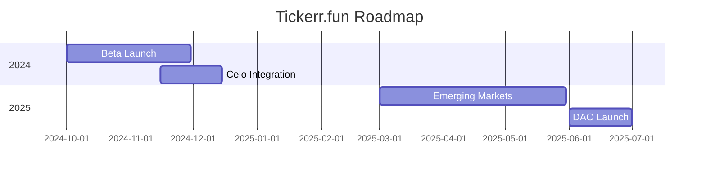

# Tickerr.fun Documentation

*Tokenizing Attention in the Creator Economy*

---

## 1. Introduction

### 1.1 What is Tickerr.fun?

A decentralized social platform combining TikTok-style engagement with Web3 economics. Fans invest in creators via token bonding curves, while viral content generates 24-hour memecoins.

### 1.2 Key Features

- Creator bonding curves with dynamic pricing
- Video-specific memecoins
- Mobile-first, low-fee transactions
- Exclusive creator-fan experiences


### 1.3 Why Tickerr.fun?

- Creators earn 10x more than traditional platforms
- Fans profit from early discovery of viral content
- Built on Celo for mobile accessibility and stablecoin liquidity

---

## 2. Core Concepts

### 2.1 Creator Bonding Curves

**Formula**:
\$ P = Base Price \times \left(1 + \frac{Supply}{Scaling Factor}\right)^{Curve Steepness} \$

**Example Parameters**:

- Base Price: \$0.01 (cUSD)
- Scaling Factor: 10,000 tokens
- Curve Steepness: 2 (quadratic growth)


### 2.2 Video Memecoins

- Auto-generated ERC-20 tokens for each video
- 24-hour expiry with liquidity recycling
- Tradable on in-app AMM


### 2.3 Token Utility

- **Creators**: Earn fees from bonding curves and memecoins
- **Fans**: Access exclusive content, voting rights, and trading rewards

---

## 3. Technical Architecture

### 3.1 System Overview

```mermaid  
graph TD  
    A[Mobile App] --&gt; B{Celo L2}  
    B --&gt; C[Creator Bonding Curves]  
    B --&gt; D[Memecoin Factory]  
    B --&gt; E[Stablecoin Swaps]  
    E --&gt; F[cUSD/cEUR Pools]  
```


### 3.2 Smart Contracts

**CreatorFactory.sol**

```solidity  
function createCreatorToken(  
    string memory _name,  
    uint256 _basePrice,  
    uint256 _scalingFactor  
) external returns (address) {  
    // Deploys new bonding curve contract  
}  
```

**Memecoin.sol**

```solidity  
contract Memecoin is ERC20 {  
    uint256 public immutable expiresAt;  
    constructor() {  
        expiresAt = block.timestamp + 24 hours;  
    }  
}  
```


### 3.3 Mobile Stack

- **Frontend**: React Native + Gesture Handler
- **Wallet**: MiniPay SDK integration
- **Off-chain**: IPFS for video storage

---

## 4. Celo Integration

### 4.1 Why Celo?

- **Mobile-first**: Ultralight client for 2G networks
- **Stablecoins**: cUSD/cEUR for price stability
- **Ecosystem**: Partnerships with Valora, impactMarket, etc.


### 4.2 Celo-Specific Features

| Feature | Benefit |
| :-- | :-- |
| SocialConnect | Spam-resistant phone-based onboarding |
| MiniPay | 1-click cashouts for 4M+ Opera users |
| Climate Collective | Optional carbon-neutral transactions |

---

## 5. Community \& Governance

### 5.1 Roles

- **Creators**: Launch tokens, set bonding curves, earn fees
- **Fans**: Trade tokens, earn rewards, govern features
- **Curators**: Stake TKR to surface trending content


### 5.2 Governance Model

1. **Proposals**: Token holders submit improvements
2. **Voting**: Quadratic weighting to prevent whale dominance
3. **Treasury**: 20% of fees fund Celo Community Fund initiatives

---

## 6. Getting Started

### 6.1 For Users

1. Download app (iOS/Android)
2. Connect Celo-compatible wallet (Valora, MiniPay)
3. Start swiping, trading, and earning

### 6.2 For Creators

1. Apply for verification
2. Set bonding curve parameters
3. Mint tokens and share referral links

---

## 7. Roadmap



---

## 8. FAQ

**Q: How are fees structured?**

- Creator bonding curves: 5% mint/burn fee
- Memecoins: 2% swap tax

**Q: Is KYC required?**

- Only for transactions > \$1,000 (Celo SocialConnect + government ID)

**Q: How does Tickerr.fun make money?**

- 15% platform fee on creator/memecoin transactions

---

## 9. Contributing

### 9.1 Open Source

- Frontend: React Native repo (Apache License)
- Contracts: Solidity (GPL-3.0)


### 9.2 Grants Program

Apply for funding to:

- Build plugins/tools
- Localize for new markets
- Create educational content

---

## 10. Legal \& Disclaimers

- Tokens are not investment instruments
- Platform fees subject to governance votes
- Compliance with local regulations required
